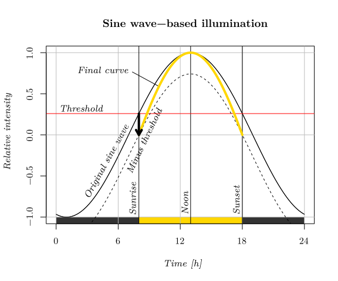

# Custom illumination unit for Chara braunii cultivation

From the publication

### Optimized protocols for the laboratory maintenance and functional testing of *Chara braunii*

Authors: Katarina Kurtović, Jan Petrášek and Stanislav Vosolsobě

Charles University, Department of Experimental Plant Biology

Code desigh: Stanislav Vosolsobě

Contact: vosolsob@natur.cuni.cz

This is Python 3 script for Raspberry PI, which enables a regulation of a custom LED panel for the cultivation of *Chara braunii*. Full script is in the file [light.py](light.py)

The regulation is based on PWM regulation. The setup enables to control "sunrise" and "sunset" times; illumination intensity can be regulated sharply (on/off), or according to sine wave, which mimics the natural light intensity.

## Import of libraries

The library `pigpio` is important for higher time-resolution of PWM generator 

```python
#!/usr/bin/python3

import time
import math
import pigpio
```

## Setting of parameters

The `sunrise` and `sunset` give the time of switching on/off the lights. The `led` array gives the relative intensities of individual LED types (on 0-100 % scale). Is the sine wave of illumination is required, set `sin_l = 1`.  The light intensity is then regulated using a sinusoidal curve with a fixed period of 24 hours, reaching its peak halfway between sunrise and sunset. If the day length (time between sunrise and sunset) differs from 12 hours, a threshold value of the sine function is calculated that matches this day-length interval. The light output is then controlled according to the normalized upper arc of the sine wave above this threshold.



Basic sinusoidal curve is computed by the equation

$$cos\frac{2 \pi (x - noon)}{24},$$

where $noon = suset - sunrise$.

The threshold at the sunrise is computed based on 

$$B = cos\frac{2 \pi (sunrise - noon)}{24}$$

and the original sive wave is shifted down by this value and normalized:

$$\frac{cos\frac{2 \pi (x - noon)}{24} - B}{1-B}$$

---

GPIO outputs must be assigned using the Raspberry Pi’s GPIO numbers, not the physical pin numbers on the header.

---

Fast test mode runs the illumination control with given time increment in each step of the main loop.

```python
# Setting of time interval for illumination in hours (e.g. 6.5 = 06:30)
sunrise = 6.0 
sunset  = 18.0 

# LED intensities (percent) for RGBWUVP — 0–100 %
led = [10, 30, 5, 100, 0, 10]

# Use sine wave illumination? (1=yes, 0=always max during day)
sin_l = 1

# GPIO PIN assignment
R = 4
B = 17
G = 18
W = 27
U = 22
P = 23

# Fast test mode — set simulated hour increments (0 for real clock)
fast_test = 0  # e.g. 0.1 for simulation
```

## Definition of control functions

```python
pi = pigpio.pi()

def LEDs(led, ilum):
    """Set duty cycle for each channel (0-100% per color * illumination curve)."""
    scale = lambda x: round(2.55 * ilum * x)
    pins = [R, G, B, W, U, P]

    for pin, pct in zip(pins, led):
        pi.set_PWM_dutycycle(pin, scale(pct))


def illum(hour, sin_mode):
    """Compute daylight intensity 0–1 based on time and sinusoidal or flat mode."""
    sunlen = sunset - sunrise
    noon = (sunrise + sunset) / 2

    # normalizing curve base
    B = math.cos(math.pi * (sunrise - noon) / 12)
    sun = math.cos(math.pi * (hour - noon) / 12) - B

    # normalized 0–1 sinusoid
    norm_light = sun / (1 - B)

    # binary day/night flag
    day = 1 if sunrise <= hour <= sunset else 0

    if sin_mode == 0:
        return day
    else:
        return max(0, day * norm_light)
```

## Main loop

```python
print("🌞 Illumination control started.")
print(f"Sunrise: {sunrise}h, Sunset: {sunset}h, Sinusoid: {sin_l}, Fast-step: {fast_test}")

# Ensure LEDs start OFF
LEDs([0,0,0,0,0,0,0], 1)
time.sleep(1)

hours = 0

while True:
    if fast_test == 0:
        now = time.localtime()
        hours = now.tm_hour + now.tm_min / 60 + now.tm_sec / 3600

    light = illum(hours, sin_l)
    LEDs(led, light)

    print(f"Time {hours:.2f}h | Light intensity: {light:.3f}")

    # increment time in simulation
    hours += fast_test
    if hours >= 24: hours = 0

    time.sleep(1 if fast_test else 5)
```

## How to install and run it?

First, install PIGPIO daemon by the instruction [here](https://abyz.me.uk/rpi/pigpio/download.html), shortly:

```sh
wget https://github.com/joan2937/pigpio/archive/master.zip
unzip master.zip
cd pigpio-master
make
sudo make install
```

Next, run PIGPIO after each start of the Raspberry Pi

```sh
sudo pigpiod
```

Finally, download [light.py](light.py) to the selected folder and run it by a command

```sh
python3 light.py
```
